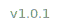

<p align="center">
  <a href="https://readme-typing-svg.demolab.com">
    
  </a>
</p>



## 👨‍💻 About Me

I'm a Full-Stack & Mobile Developer based in Thailand 🇹🇭, building websites, web apps, and cross-platform mobile apps — mainly focused on frontend and mobile, with backend when the project needs it.

- 🔭 Currently building **[agentive](https://github.com/TiPS0/agentive)** — a universal AI agent workspace CLI for developers
- ⚛️ Specialized in **React** · **Next.js** · **Nuxt.js** for modern web development
- 📱 Experienced in **React Native + Expo** for iOS & Android production apps
- 🧠 Passionate about **AI-native development** and agentic tooling
- ⚡ Fun fact: My code is reviewed by AI agents more often than humans

## 🛠️ Tech Stack

**Frontend & Web**

[](https://skillicons.dev)

**Mobile**

[](https://skillicons.dev)

**Backend & Infrastructure**

[](https://skillicons.dev)

**Tools & Workflow**

[](https://skillicons.dev)

## 🚀 Featured Project — [`@p_tipso/agentive`](https://github.com/TiPS0/agentive)

**A universal, framework-agnostic AI agent workspace CLI**

[](https://www.npmjs.com/package/@p_tipso/agentive)
[](https://www.npmjs.com/package/@p_tipso/agentive)
[](https://github.com/TiPS0/agentive/stargazers)
[](https://opensource.org/licenses/MIT)

Stop maintaining separate rule files for every AI tool. **agentive** scaffolds a `.agents/` workspace, `AGENTS.md`, and `.aiignore` — a **single source of truth** for all your AI agents.

```bash
npx @p_tipso/agentive@latest
```

## 📊 GitHub Stats

<p align="center">
  
</p>

## 🔗 Links

[](https://github.com/TiPS0)
[](https://www.npmjs.com/~p_tipso)
[](https://www.linkedin.com/in/pakawat-tipso/)


